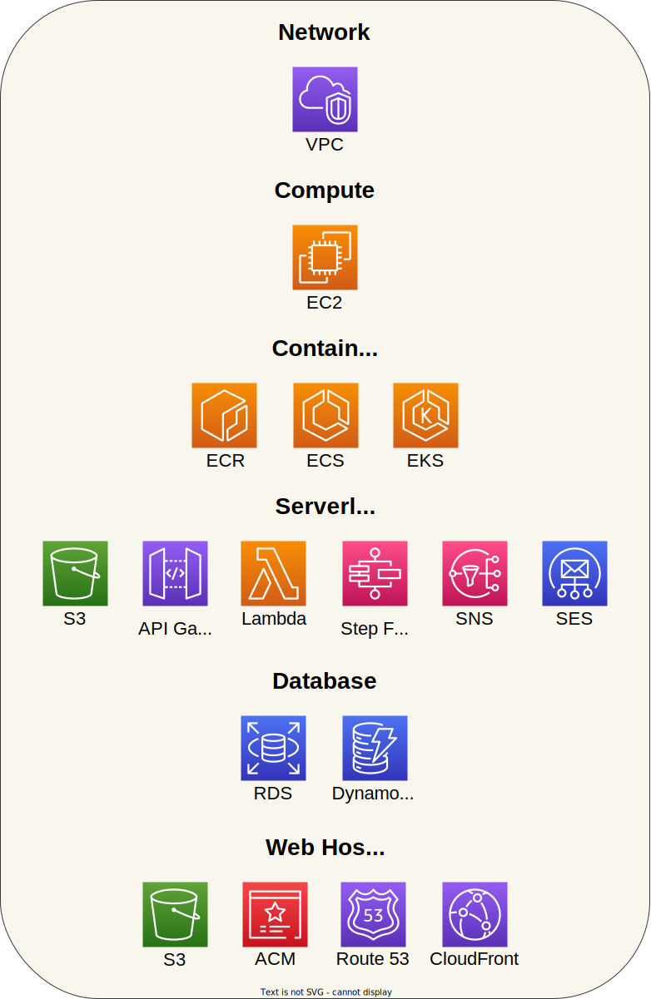

# AWS Stacks

## Before starting

The project is maintained in a private Gitlab repository, but is mirrored and shared publicly in this Github repository. The project uses Gitlab CI to automate the deployment of resources.

## Purpose

This project is intended for learning purposes, in order to learn **how to use AWS services**, and **how to make the services work together**.

AWS is composed of a multitude of services. **Each service has a specific function and is part of a specific category** (Computing, Serverless, Storage ...).
The project will contain several stacks, **each stack containing several services of the same category**.

This way, it will be possible to **observe if some stacks are dependent on other stacks** (e.g. does Computing stack need Networking stack ?), **or if they can work independently of the others**.

## Overview

Here is the current structure of the project:

